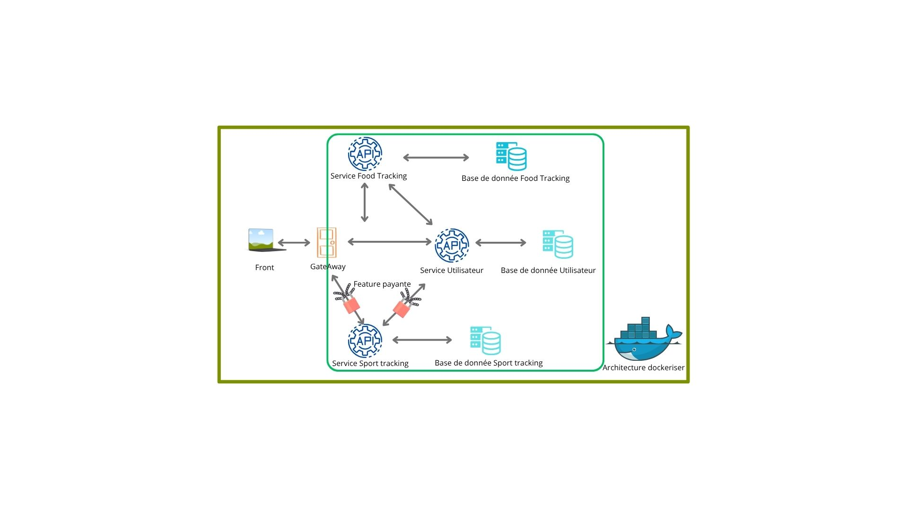

# Calories Project – API Gateway (Proxy avec logs)

Ce projet est un proxy de démarrage pour une architecture microservices, servant d'API Gateway.

## Fonctionnalités
- Redirige les requêtes vers des endpoints fictifs (`/api/user`, `/api/sport`)
- Conteneurisé avec Docker

##  Démarrage

### 1. Prérequis
- Node.js
- Docker & Docker Compose

### 2. Cloner le projet
```bash
git clone <url-du-repo>
cd calories-project

### 2. Cloner le projet

